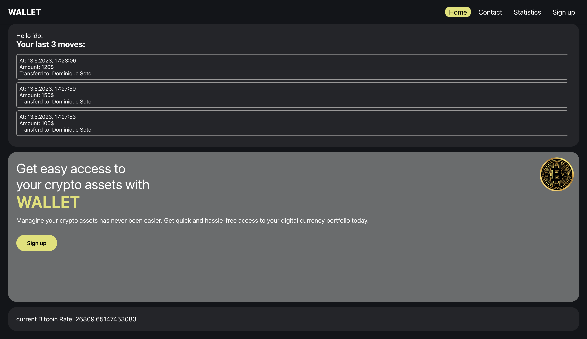
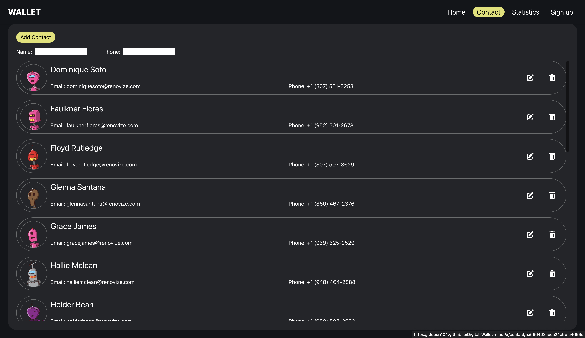
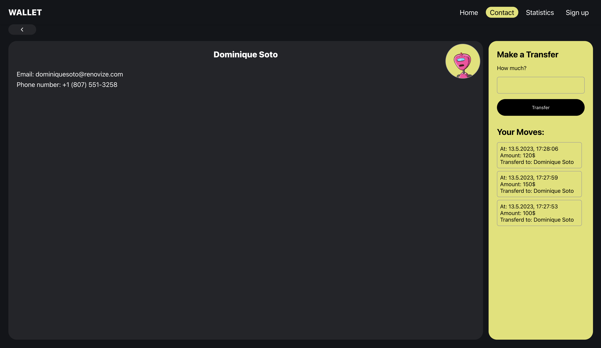

# Digital Wallet React

This is a simple web frontend application for managing your digital wallet. The frontend is built using React and styled using SCSS.

You can try out the application by visiting the [project website](https://idoperi104.github.io/Digital-Wallet-react/).

## Screenshots

Here are a few screenshots of the application:

1. **Home page**

   

   This screenshot shows the home page of the application, which displays a summary of your digital wallet balance and a list of all your recent transactions.

3. **Contact Page**

   

   This screenshot shows a list of your contacts. You can edit and delete each one of them.

4. **Contact Details Page*

   

   This screenshot shows the details of the contact and all the transfers you send him.
   
   ## Getting Started

To run the application locally, you will need to have [Node.js](https://nodejs.org/) installed on your machine. Once you have installed Node.js, clone this repository and navigate to the project directory in your terminal. Then run the following command to install the project dependencies:

```
npm install
```

Once the dependencies are installed, you can run the following command to start the application:

```
npm start
```

This will start the development server and open the application in your default web browser.
